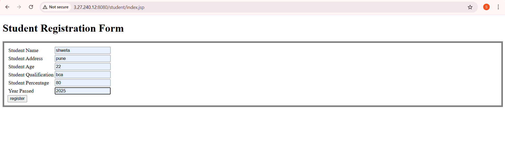
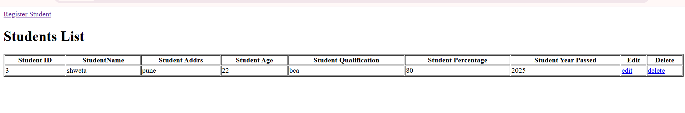

# 🎓 Student Management Application Deployment (Monolithic Architecture)

## 📌 Project Overview

This project demonstrates deployment of a Java-based Student Management Application using a Monolithic Architecture on AWS infrastructure.

The application is deployed using:

- Amazon EC2 (Ubuntu Server)
- Apache Tomcat 9
- Amazon RDS (MySQL)
- Java 11
- JDBC (MySQL Connector)

The application follows a 3-Tier Architecture:

User → Application Server (Tomcat on EC2) → Database (RDS MySQL)

---

# 🏗 Architecture Diagram (Logical Flow)

Presentation Layer  →  Student UI (WAR File)  
Application Layer   →  Apache Tomcat  
Database Layer      →  Amazon RDS MySQL  

Ports Used:
- Tomcat → 8080
- MySQL → 3306

---

# 🚀 Step-by-Step Deployment Process

## 1️⃣ Create RDS MySQL Database

- Engine: MySQL
- DB Identifier: studentapp
- Username: admin
- Public Access: Enabled

---

## 2️⃣ Launch Ubuntu EC2 Instance

- OS: Ubuntu
- Connect using SSH

---

## 3️⃣ Download Application Files

Download WAR file from S3:

```bash
curl -O https://s3-us-west-2.amazonaws.com/studentapi-cit/student.war
```

Clone studetapp-ui Repository:

```bash
git clone https://github.com/shwetabhore18/studentapp-ui.git
```

---

## 4️⃣ Install Apache Tomcat 9

```bash
cd /opt
curl -O https://dlcdn.apache.org/tomcat/tomcat-9/v9.0.115/bin/apache-tomcat-9.0.115.zip
sudo apt install unzip -y
unzip apache-tomcat-9.0.115.zip
```
---

## 5️⃣ Install Java 11

```bash
sudo apt update
sudo apt install openjdk-11-jdk -y
```

Verify Java:

```bash
java -version
```

---

## 6️⃣ Start Tomcat Server

```bash
cd /opt/apache-tomcat-9.0.115/bin
bash catalina.sh start
```

Verify in browser:

```
http://<Public-IP>:8080
```

Default Tomcat page should be visible.

---

## 7️⃣ Deploy Application WAR File

Move WAR file to webapps directory:

```bash
mv /root/student.war /opt/apache-tomcat-9.0.115/webapps/
```

Tomcat automatically deploys applications placed inside `webapps`.

Access application:

```
http://<Public-IP>:8080/student
```

Frontend will load successfully.



---

After RDS is created:

```bash
/opt#
apt install mysql-client -y
mysql -h <RDS-ENDPOINT> -u admin -ppassword
```

Create database:

```sql
CREATE DATABASE studentapp;
USE studentapp;

CREATE TABLE IF NOT EXISTS students(
    student_id INT NOT NULL AUTO_INCREMENT,
    student_name VARCHAR(100) NOT NULL,
    student_addr VARCHAR(100) NOT NULL,
    student_age VARCHAR(3) NOT NULL,
    student_qual VARCHAR(20) NOT NULL,
    student_percent VARCHAR(10) NOT NULL,
    student_year_passed VARCHAR(10) NOT NULL,
    PRIMARY KEY (student_id)
);

show tables;
exit;
```
---

## 8️⃣ Configure Database Connection

### Copy MySQL Connector JAR

```bash
cp /root/studentapp-ui/mysql-connector.jar /opt/apache-tomcat-9.0.115/lib/
```

### Copy context.xml

```bash
cp -rf /root/studentapp-ui/context.xml /opt/apache-tomcat-9.0.115/conf/
```

---

## 9️⃣ Edit context.xml

Open file:

```bash
vim /opt/apache-tomcat-9.0.115/conf/context.xml or vim context.xml "u must present in **conf**
```

Update database details:

```xml
          username="admin"
          password="your_password"
          databasename = "name"
          url="jdbc:mysql://<RDS-ENDPOINT>:3306/studentapp"
```

Save and exit.

---

## 🔁 Restart Tomcat

```bash
cd /opt/apache-tomcat-9.0.115/bin
bash catalina.sh stop
bash catalina.sh start
```

---

## ✅ Final Verification

Open:

```
http://<Public-IP>:8080/student
```

Fill the form → Submit



Then verify in database:

```bash
mysql -h <RDS-ENDPOINT> -u admin -p
USE studentapp;
SELECT * FROM students;
```

Data should be successfully stored in RDS.

---

# 🧠 Important Concepts Used

- Monolithic Application Deployment
- 3-Tier Architecture
- EC2 Provisioning
- RDS MySQL Configuration
- WAR Deployment on Tomcat
- JDBC Driver Configuration
- context.xml DataSource Setup
- Linux Package Management

---

# 📂 Important File Locations

Tomcat Directory → /**opt**/apache-tomcat-9.0.115  
Catalina Script → /opt/apache-tomcat-9.0.115/**bin**  
WAR Deployment Folder → **webapps**  
MySQL Connector .jar file → **lib**  
Database Config File → **conf**/context.xml  

---

# 🎯 Project Outcome

✔ Application deployed successfully on EC2  
✔ RDS MySQL connected via JDBC  
✔ Data inserted into remote database  
✔ End-to-End connectivity verified  

---

# 📌 Future Enhancements

- Dockerize the application
- Use Docker Compose
- Add Nginx reverse proxy
- Implement Load Balancer
- Add Auto Scaling
- Automate using Shell Script
- CI/CD Pipeline Integration

---

# 👩‍💻 Author

Shweta Bhore  
DevOps Learner | AWS | Linux | Java Deployment


